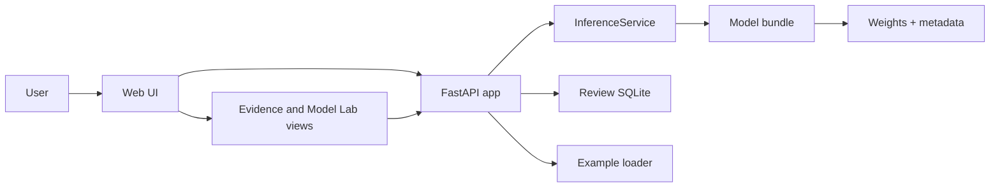
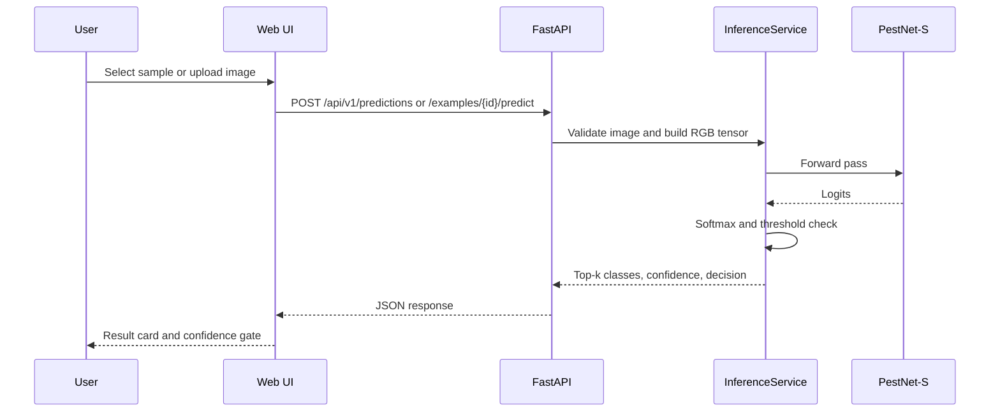
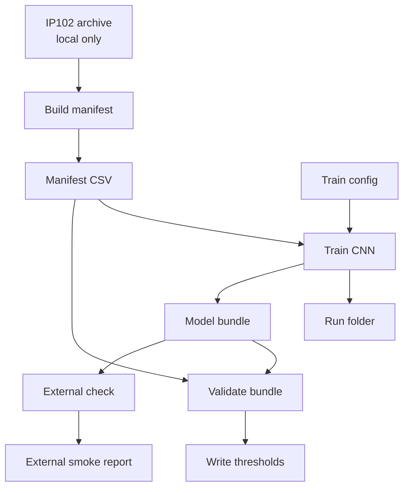
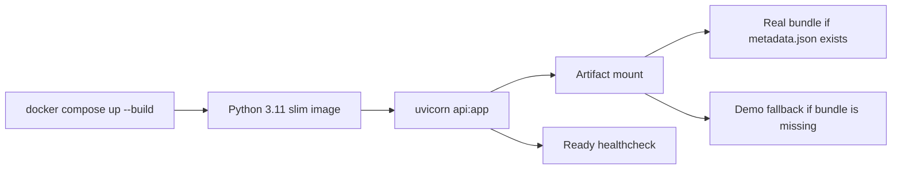

# PestScope Field Lab Design Report

Status: implemented local prototype  
Last reviewed: 2026-07-05  
Main goal: show a reproducible crop-pest CNN project without pretending it is a
finished farm product.

## 1. What This Project Solves

PestScope Field Lab is a small web app for pest-image classification. A user can
open the app, pick a sample image or upload a photo, and see:

- the top predicted pest classes;
- whether the prediction is accepted, uncertain, or unsupported;
- evidence from the training run;
- common failure cases;
- real CNN activation maps for the selected sample.

The project is not a pesticide recommendation tool. It only focuses on image
classification and model evidence.

## 2. Dataset Scope

The project uses IP102 as the research dataset. The official IP102 sources report
102 pest classes, 75,222 classification images, and 18,976 bounding-box images.
This repository uses the classification split only.

Sources:

- Official repository: https://github.com/xpwu95/IP102
- Project page: https://mmcheng.net/ip102/
- Paper: https://openaccess.thecvf.com/content_CVPR_2019/html/Wu_IP102_A_Large-Scale_Benchmark_Dataset_for_Insect_Pest_Recognition_CVPR_2019_paper.html

The repo does not commit raw IP102 images. Local data and model artifacts stay in
`data/` and `artifacts/`.

Current public scope is 12 reviewed classes:

| IP102 id | English name | Scientific name | Split counts |
| --- | --- | --- | --- |
| 1 | Rice Leaf Folder | Cnaphalocrocis medinalis | 669 train / 111 val / 335 test |
| 8 | Brown Planthopper | Nilaparvata lugens | 500 / 83 / 251 |
| 40 | Beet Armyworm | Spodoptera exigua | 962 / 160 / 482 |
| 87 | Tobacco Cutworm | Spodoptera litura | 782 / 130 / 392 |
| 72 | Greenhouse Whitefly | Trialeurodes vaporariorum | 415 / 69 / 208 |
| 77 | Cottony Cushion Scale | Icerya purchasi | 433 / 72 / 217 |
| 83 | Orange Spiny Whitefly | Aleurocanthus spiniferus | 414 / 68 / 208 |
| 85 | Oriental Fruit Fly | Bactrocera dorsalis | 263 / 44 / 132 |
| 58 | Green Mirid Bug | Apolygus lucorum | 228 / 38 / 115 |
| 75 | Citrus Red Mite | Panonychus citri | 231 / 38 / 116 |
| 89 | Citrus Leafminer | Phyllocnistis citrella | 242 / 40 / 122 |
| 98 | Mango Shoot Borer | Chlumetia transversa | 183 / 30 / 92 |

The 12-class scope is intentional. Training all 102 classes would make the demo
slower and less reliable for a student project. The smaller scope makes it easier
to show the full ML workflow end to end.

## 3. System Architecture



Runtime responsibilities:

- `index.html`, `app.js`, and `styles.css` render the app.
- `api.py` exposes the web app and JSON endpoints.
- `src/pestscope/inference/service.py` loads the model bundle and runs
  inference.
- `src/pestscope/modeling/pestnet.py` defines the CNN.
- `src/pestscope/training/*` handles datasets, training, metrics, and bundle
  writing.
- `src/pestscope/evaluation/*` handles validation calibration and external
  benchmark checks.

## 4. Inference Flow



Decision rules are simple on purpose:

- confidence >= accepted threshold: `accepted`;
- confidence >= uncertain threshold: `uncertain`;
- otherwise: `unsupported`.

Thresholds come from the model bundle metadata unless environment variables
override them.

## 5. Model Design

The main model is `PestNet-S`, a compact residual CNN trained from scratch. It
does not use pretrained ImageNet weights.

```mermaid
flowchart LR
    input["Input<br/>3 x 224 x 224"] --> stem["ConvNormAct<br/>32 x 112 x 112"]
    stem --> r32["ResidualBlock<br/>32 x 112 x 112"]
    r32 --> r64a["ResidualBlock stride 2<br/>64 x 56 x 56"]
    r64a --> r64b["ResidualBlock<br/>64 x 56 x 56"]
    r64b --> r128a["ResidualBlock stride 2<br/>128 x 28 x 28"]
    r128a --> r128b["ResidualBlock<br/>128 x 28 x 28"]
    r128b --> r256a["ResidualBlock stride 2 + SE<br/>256 x 14 x 14"]
    r256a --> r256b["ResidualBlock + SE<br/>256 x 14 x 14"]
    r256b --> pool["AdaptiveAvgPool2d<br/>256 values"]
    pool --> head["Dropout + Linear<br/>12 logits"]
    head --> gate["Softmax + thresholds"]
```



Current default config:

- image size: `224`;
- width: `32`;
- dropout: `0.25`;
- classes: `12`;
- trainable parameters: `2,812,908`;
- loss: cross entropy with weighted classes;
- seed: `2026`.

Baselines and ablations:

- `simple_cnn`: smaller baseline to compare against PestNet-S;
- `pestnet_s_no_attention`: removes squeeze-excitation attention;
- `pestnet_s_optimized`: later tuning config, not the default reported result.

## 6. Training And Evaluation Workflow



Main commands:

```powershell
python scripts\build_ip102_manifests.py

python scripts\train_pestnet.py `
  --config configs\train\pestnet_s.yaml `
  --device auto `
  --progress

python scripts\evaluate_pestnet_bundle.py `
  --config configs\train\pestnet_s.yaml `
  --bundle-dir artifacts\models\pestnet_s_latest `
  --split val `
  --device auto `
  --write-thresholds
```

The validation split is used for model selection and threshold calibration. The
official test split is kept for final evaluation and should not be used to write
thresholds.

## 7. Evidence Shown In The App

The app has four main views:

- Inspect: run sample/upload inference.
- Species: show supported classes and class-level behavior.
- Evidence: show training curves, split counts, confusion matrix, failure cases,
  and reproducibility commands.
- Model: show layer-by-layer CNN behavior for the selected sample.

Model Lab uses real API endpoints, not static drawings:

- `/api/v1/examples/{id}/stem-activations`
- `/api/v1/examples/{id}/residual32-activations`
- `/api/v1/examples/{id}/residual64-activations`
- `/api/v1/examples/{id}/residual128-activations`
- `/api/v1/examples/{id}/attention-activations`
- `/api/v1/examples/{id}/global-pool-activations`
- `/api/v1/examples/{id}/decision-gate`

Each endpoint runs the current model on the selected image and returns feature
maps or classifier evidence.

## 8. API Contract

Important endpoints:

| Method | Endpoint | Purpose |
| --- | --- | --- |
| GET | `/api/v1/health/live` | Process is alive |
| GET | `/api/v1/health/ready` | Model bundle can be loaded |
| GET | `/api/v1/model` | Model card, classes, thresholds, metrics |
| GET | `/api/v1/experiments/current` | Evidence payload for the Evidence page |
| GET | `/api/v1/examples` | Available sample images |
| POST | `/api/v1/examples/{id}/predict` | Predict a bundled sample |
| POST | `/api/v1/predictions` | Predict an uploaded image |
| POST | `/api/v1/reviews` | Store manual feedback |
| GET | `/api/v1/reviews/summary` | Review count summary |

The API rejects invalid images, images above the configured upload size, and
images with too many pixels.

## 9. Docker Deployment



Docker choices:

- CPU PyTorch image for predictable first run;
- non-root `appuser`;
- healthcheck against `/api/v1/health/ready`;
- `./artifacts:/app/artifacts` mount for model bundles and review DB;
- `PESTSCOPE_PORT` for changing the host port.

Demo fallback exists only so the app opens on a clean machine. It is marked as
`demo_model: true` and must not be used as model performance evidence.

## 10. Current Verification

The latest local verification before this report rewrite:

```text
python -m pytest -q
26 passed

python -m ruff check src\pestscope api.py scripts tests --no-cache
All checks passed

docker compose config --quiet
Passed
```

The Docker app was also tested locally with `/api/v1/health/ready` returning
`status: ready`.

## 11. Known Limits

- Only 12 IP102 classes are supported in the public demo.
- Current metrics are modest; the UI shows failures instead of hiding them.
- IP102 is not a Vietnam-specific farm dataset.
- Raw IP102 data and trained model weights are not committed to Git.
- The external benchmark is small and should be treated as a smoke test.
- The app classifies images; it does not give treatment or pesticide advice.

## 12. What Still Needs Manual Work

1. Download IP102 v1.1 after accepting its academic-use terms.
2. Build the manifest locally.
3. Train or copy a real bundle into `artifacts/models/pestnet_s_latest`.
4. Run validation calibration before reporting metrics.
5. Run a final test-set evaluation only after the model and thresholds are
   frozen.
