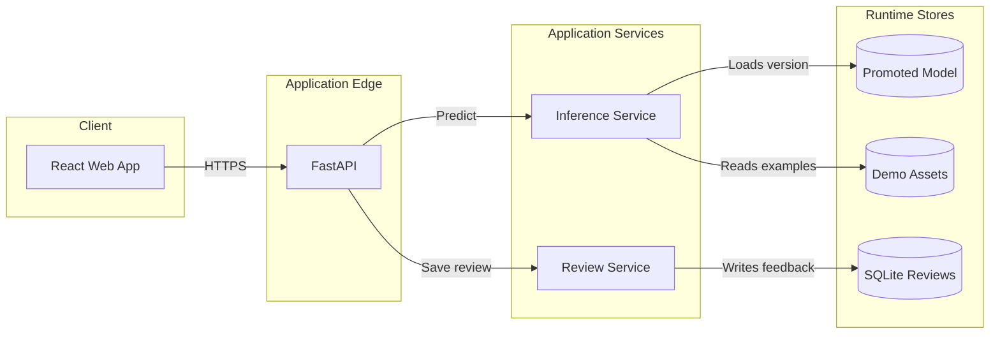
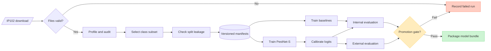
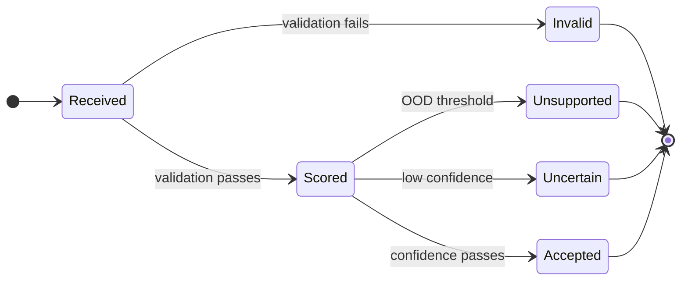
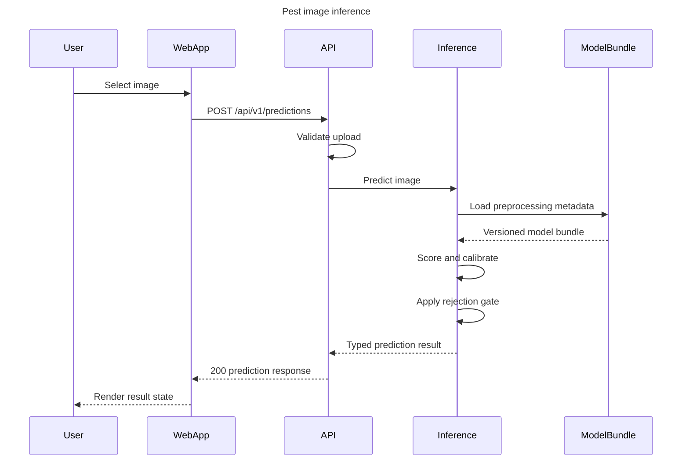
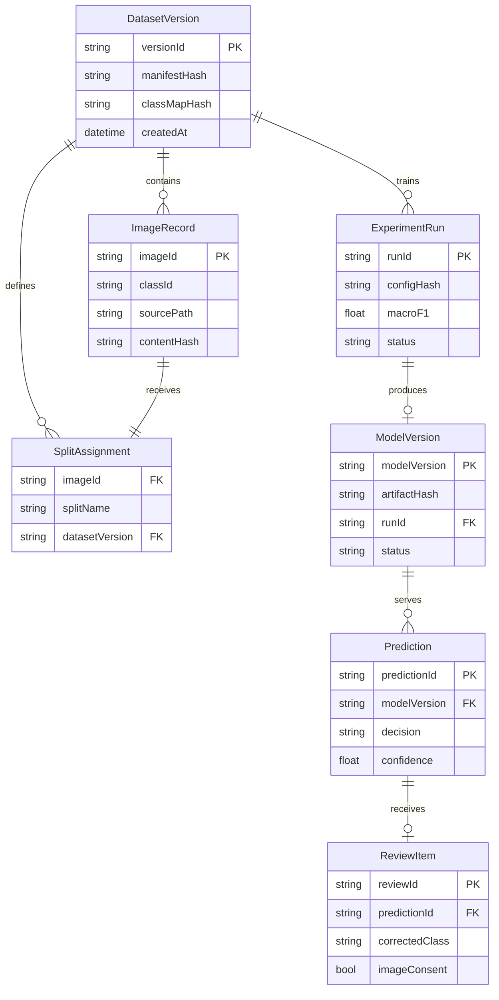
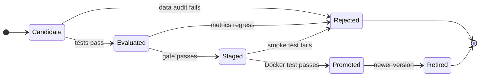
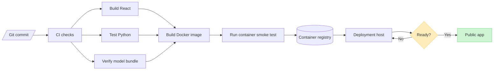
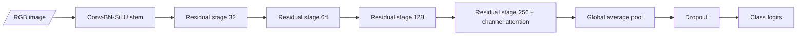
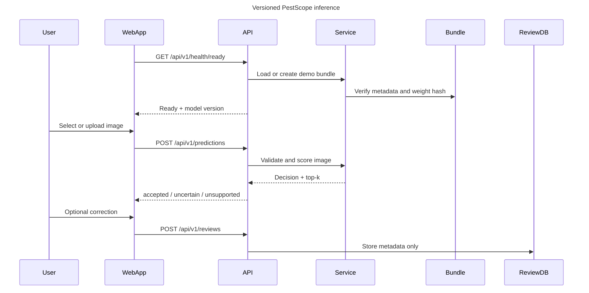

# PestScope Field Lab

> Design report for review  
> Status: **Implementation in progress - Sections 1 through 6 completed**
> Purpose: agree on the ML problem, system boundaries, workflow, deployment, and acceptance gates before changing the codebase.

## 1. Executive summary

The project will become a **field-image pest triage system** built around IP102. Its value is not simply predicting one of many insect labels. The work will demonstrate how a machine-learning system is designed for three difficult conditions that appear in real applications:

1. IP102 has a long-tailed class distribution.
2. Images found in the field or on the web differ from the training distribution.
3. A classifier must be allowed to say **unsupported or uncertain** instead of returning a confident wrong answer.

The production model will be a compact CNN designed and trained from scratch. Pretrained ImageNet weights will not be used for the main result. A simple CNN and a classical baseline will remain in the repository so the benefit of each design choice can be measured instead of merely claimed.

The first version will support a data-driven subset of approximately 12 IP102 classes. The final classes will be selected only after data profiling. Starting with all 102 classes would increase training cost and make the demo less reliable without proving more engineering skill.

The app will be Vietnamese-first, work on CPU, include licensed example images, and return useful predictions immediately after the first Docker start. Training and production serving will be separate workflows.

## 2. Problem definition

### 2.1 User problem

A user has a photo containing one dominant insect and wants an initial visual triage result:

- the most likely supported pest class;
- confidence and two alternative classes;
- whether the image is outside the supported scope;
- a concise explanation of model limitations;
- an optional way to report an incorrect result.

This is a recognition aid, not an agronomic diagnosis and not pesticide advice.

### 2.2 ML task

**Primary task:** multiclass image classification over a selected IP102 subset.

**Secondary task:** out-of-distribution rejection for:

- pests belonging to IP102 classes outside the selected subset;
- non-pest images;
- images too ambiguous or visually unlike the training distribution.

**Input contract:** JPEG, PNG, or WebP image with one dominant insect; maximum upload size and dimensions will be enforced by the API.

**Output contract:** model version, top-k predictions, calibrated confidence, rejection decision, rejection reason, and inference latency.

### 2.3 Why this is relevant in Vietnam

The project will not claim that IP102 perfectly represents Vietnamese farms. That would be scientifically weak. Instead, it will treat this mismatch as a measurable domain-shift problem:

- use Vietnamese common names where a mapping can be verified;
- retain scientific names to avoid ambiguous local naming;
- evaluate on licensed external images that were not used during training;
- show failures and uncertainty instead of hiding them;
- target CPU deployment suitable for low-cost infrastructure.

The practical story is therefore: **build a reproducible pest-image triage pipeline and measure how well it survives outside its benchmark dataset.**

## 3. Dataset scope and constraints

IP102 contains more than 75,000 images across 102 pest categories, has a naturally long-tailed distribution, and provides bounding-box annotations for about 19,000 images. The original repository states that the dataset is for academic use; commercial use requires contacting the authors.

Sources:

- [Official IP102 repository](https://github.com/xpwu95/IP102)
- [CVPR 2019 paper](https://openaccess.thecvf.com/content_CVPR_2019/html/Wu_IP102_A_Large-Scale_Benchmark_Dataset_for_Insect_Pest_Recognition_CVPR_2019_paper.html)

### 3.1 Repository policy

- IP102 images will never be committed to Git or copied into the production Docker image.
- Downloaded data, generated splits, checkpoints, and local experiment runs will be ignored by Git.
- The repository will contain download instructions, checksums where available, manifests, and attribution metadata.
- Demo images will come from sources that permit redistribution and will include attribution.
- Model weight distribution will be documented separately from dataset distribution. The academic-use limitation will be visible in the README and model card.

### 3.2 Class subset selection

The initial class list will be produced by a script and an EDA report, not chosen by intuition. A class is eligible when it meets all of these conditions:

1. enough train and validation samples for a meaningful experiment;
2. no severe corruption or duplicate concentration;
3. visually interpretable labels and taxonomy;
4. licensed external images can be found for validation;
5. the final subset is not dominated by near-identical classes.

The selection manifest will record the reason each class is included or excluded. The approximate target is 12 classes, but the EDA gate may recommend 10 to 15.

### 3.3 Split and leakage controls

- Filter the official IP102 train, validation, and test split by selected class.
- Never tune hyperparameters or rejection thresholds on the official test split.
- Run exact-hash and perceptual-hash checks across splits.
- Produce a duplicate report before training.
- Keep the external web-image benchmark immutable after its first approved version.

## 4. System architecture

The production surface is deliberately small. React is compiled to static assets and served by FastAPI, so production remains one application container. Training is a separate offline workflow and is not exposed through the web API.



### 4.1 Runtime responsibilities

**React web app**

- upload, drag-and-drop, and built-in sample selection;
- result, alternatives, uncertainty, and limitation states;
- responsive Vietnamese-first interface;
- no training controls and no misleading live-learning animation.

**FastAPI**

- validates files and request limits;
- exposes versioned prediction and metadata endpoints;
- serves the compiled frontend;
- reports liveness and model readiness separately.

**Inference service**

- owns preprocessing, model loading, calibration, top-k ranking, and rejection;
- validates that checkpoint, class map, and preprocessing metadata share one version;
- returns stable typed responses.

**Review service**

- records optional user feedback for later offline analysis;
- never updates the deployed model directly;
- does not retain uploaded images unless the user explicitly opts in.

## 5. Data and training workflow



### 5.1 Reproducibility contract

Every experiment will save:

- Git commit and dirty-worktree flag;
- dataset manifest version and selected classes;
- random seed and full training configuration;
- model parameter count and input preprocessing;
- best checkpoint selected by validation macro-F1;
- internal, external, calibration, and OOD metrics;
- environment and hardware summary;
- training curves and confusion matrix.

An experiment that cannot identify its data and configuration is not eligible for promotion.

### 5.2 Augmentation policy

Allowed transformations should improve field robustness without changing insect identity:

- random resized crop with conservative limits;
- horizontal flip where biologically acceptable;
- small rotation;
- mild color jitter;
- occasional blur and JPEG compression.

Aggressive geometric warping, heavy cutout, or color transforms that erase taxonomic cues will not be used without an ablation proving their value.

### 5.3 Long-tail strategy

The initial controlled comparison will evaluate:

1. ordinary shuffled sampling with cross-entropy;
2. weighted sampling;
3. class-balanced loss or focal loss.

Only one imbalance intervention will be added at a time. Macro-F1 and per-class recall, rather than accuracy alone, will decide which strategy remains.

## 6. Model design

### 6.1 Baselines

The repository will retain three comparable levels:

| Level | Model | Purpose |
|---|---|---|
| Classical | HOG plus color features with linear classifier | Establish a non-deep-learning floor |
| Simple CNN | Three convolution blocks | Show what a minimal CNN learns |
| Main model | PestNet-S trained from scratch | Demonstrate the proposed architecture |

All models will use the same approved splits and evaluation code.

### 6.2 PestNet-S

PestNet-S is a compact residual CNN designed for 224 x 224 RGB images. It uses no pretrained backbone.


Proposed block rules:

- `3 x 3 convolution -> batch normalization -> SiLU`;
- residual shortcut whenever input and output shapes permit;
- stride-2 downsampling only at stage boundaries;
- lightweight squeeze-and-excitation style channel attention near the final stage;
- global average pooling instead of a large fully connected stack;
- parameter and FLOP report generated by test, not typed by hand.

The exact number of blocks and channels is provisional until memory, latency, and baseline results are measured.

### 6.3 Ablation plan

The report will compare the main model against controlled removals:

- residual connections removed;
- channel attention removed;
- selected long-tail strategy removed;
- field-oriented augmentation removed;
- calibration and OOD gate removed.

This turns architecture choices into evidence instead of decoration.

## 7. Calibration and unknown rejection

A normal softmax classifier always chooses a class. That behavior is unsafe for a public demo because unsupported insects and unrelated images will still receive a label.

The system will compare maximum-softmax probability and energy score as rejection signals. Temperature scaling and rejection threshold selection will use validation data only.

Two unknown sets are required:

- **near OOD:** IP102 classes excluded from the selected subset;
- **far OOD:** licensed non-pest and unrelated images.

The API returns `accepted`, `uncertain`, or `unsupported`. Unknown is a decision state, not a fake thirteenth training class.



## 8. Inference workflow



### 8.1 Public API

| Method | Endpoint | Responsibility |
|---|---|---|
| `GET` | `/api/v1/health/live` | Process is running |
| `GET` | `/api/v1/health/ready` | Model bundle is loaded and valid |
| `GET` | `/api/v1/model` | Model card summary and supported classes |
| `GET` | `/api/v1/examples` | Licensed first-run samples and known results |
| `POST` | `/api/v1/predictions` | Validate and classify one image |
| `POST` | `/api/v1/reviews` | Save optional feedback for offline review |

The OpenAPI schema is part of the contract and will be tested.

## 9. User experience design

The first screen is the actual recognition workspace, not a marketing landing page.

### 9.1 First-run path

1. The page opens with one precomputed example selected.
2. The model status and supported scope are visible without technical clutter.
3. The user can choose two more licensed examples or upload an image.
4. A result appears with common name, scientific name, confidence, and alternatives.
5. Unsupported images receive a clear rejection state instead of a forced label.

### 9.2 Information hierarchy

- **Primary:** image, result, confidence, and supported/unsupported state.
- **Secondary:** alternatives and short uncertainty message.
- **Expandable:** model details, metrics, class coverage, and limitations.
- **Separate view:** experiment evidence such as confusion matrix and ablation results.

Long instructions will not sit above the upload control. Guidance will use short inline states, tooltips, and one compact “How it works” drawer.

### 9.3 Frontend choice

Use React, TypeScript, and Vite for predictable component states and API types. Vite is a build-time dependency only. The production FastAPI container serves the generated static assets, so the user does not need Node.js at runtime.

## 10. Data entities



Experiment metadata and dataset manifests will be files under version control or ignored artifact directories. SQLite is only for runtime feedback, not a replacement for experiment tracking.

## 11. Proposed repository structure

```text
.
|-- configs/
|   |-- data/ip102_subset.yaml
|   `-- train/pestnet_s.yaml
|-- frontend/
|   |-- src/
|   `-- package.json
|-- src/pestscope/
|   |-- api/
|   |-- data/
|   |-- evaluation/
|   |-- inference/
|   `-- modeling/
|-- scripts/
|   |-- download_ip102.py
|   |-- build_manifests.py
|   |-- train.py
|   |-- evaluate.py
|   `-- export_model.py
|-- tests/
|   |-- api/
|   |-- data/
|   |-- modeling/
|   `-- smoke/
|-- demo_assets/
|   `-- attribution.json
|-- artifacts/                  # ignored by Git
|-- Dockerfile
|-- docker-compose.yml
|-- pyproject.toml
`-- README.md
```

The old project will not be deleted in one blind pass. Each existing file will first be classified as **reuse, replace, migrate, or remove**. A file is removed only after its behavior is replaced and the new smoke test passes.

## 12. Testing strategy

### 12.1 Unit tests

- manifest parsing and deterministic subset selection;
- image validation and preprocessing equivalence;
- CNN tensor shapes and parameter count bounds;
- loss weighting and metric calculations;
- calibration and rejection decisions;
- model-bundle hash and version validation.

### 12.2 Integration tests

- train one mini epoch on a tiny fixture dataset;
- export and reload the resulting model bundle;
- send an image through the real API;
- verify accepted, uncertain, unsupported, and invalid-image responses;
- verify feedback persistence without image retention by default.

### 12.3 End-to-end tests

- start the Docker image from a clean environment;
- wait for readiness, not merely process liveness;
- open the app at desktop and mobile widths;
- run each bundled example and one upload;
- verify no overlapping UI, broken assets, or console errors.

### 12.4 Evaluation metrics

| Area | Primary | Supporting |
|---|---|---|
| Classification | Macro-F1 | Balanced accuracy, per-class recall, top-1, top-3 |
| Calibration | Expected calibration error | Negative log-likelihood, reliability plot |
| OOD rejection | AUROC | FPR95, accepted-error rate |
| Runtime | CPU p95 latency | p50 latency, memory, bundle size |
| Robustness | External-set macro-F1 | Internal-to-external performance drop |

No accuracy target will be invented before the EDA and baseline exist. The final model must beat the simple CNN under the same data and compute budget, and every promotion decision must show its evidence.

## 13. Model promotion lifecycle



Promotion requires all of the following:

- dataset and class manifests are traceable;
- no unresolved cross-split duplicate warning;
- the custom CNN improves macro-F1 over the simple CNN;
- calibration does not regress after temperature scaling;
- the OOD threshold is selected without touching test data;
- all model, API, and Docker smoke tests pass;
- CPU latency and memory are recorded on named hardware;
- limitations and failed classes are included in the model card.

## 14. Deployment design

### 14.1 Production artifact

The production artifact is one immutable Docker image containing:

- Python runtime and CPU inference dependencies;
- FastAPI application;
- compiled React assets;
- a promoted model bundle;
- licensed demo images and attribution manifest;
- health-check command.

It will not contain the IP102 dataset, training caches, notebooks, or experiment logs.



### 14.2 Model artifact strategy

The promoted model bundle should contain:

```text
model.pt
metadata.json
class_map.json
preprocessing.json
metrics.json
SHA256SUMS
```

For local development, Docker Compose mounts a promoted bundle read-only. For public deployment, CI downloads the exact release artifact and verifies its SHA-256 before building the image. A missing or mismatched model must fail the build rather than silently starting with random weights.

### 14.3 First-run guarantee

`docker compose up --build` must produce a usable app without training. Readiness becomes healthy only after the model bundle and class map are loaded successfully. The landing workspace immediately exposes bundled external examples with expected decision states.

### 14.4 CI pipeline

Pull requests will run:

1. Python formatting, lint, type checks, and tests;
2. frontend lint, type check, tests, and production build;
3. tiny synthetic training smoke test;
4. model-bundle load test;
5. API integration test;
6. Docker build and first-run health test.

Full IP102 training will remain a manual, reproducible workflow because it requires the dataset and substantial compute. Promotion is manual after reviewing the generated evaluation report.

## 15. Security, privacy, and failure behavior

- Reject malformed files by decoding image content, not trusting filename extensions.
- Set request-size, pixel-count, and inference time limits.
- Strip metadata before optional image retention.
- Do not log image bytes or full local filenames.
- Require explicit consent before saving a review image.
- Return stable error codes without exposing stack traces.
- Rate limiting is optional for local use and required before a public deployment.
- The UI must state that output is not treatment advice.

## 16. Implementation sections and approval gates

Implementation will proceed section by section. No later section begins until its gate is reviewed.

| Section | Deliverable | Approval gate |
|---|---|---|
| 1. Repository audit | File inventory, keep/remove map, target structure | No necessary behavior is lost |
| 2. Data foundation | Downloader, manifests, EDA, class shortlist | Subset and split report approved |
| 3. Baselines | Classical and simple-CNN results | Metrics are reproducible |
| 4. PestNet-S | Custom CNN, training, ablations | Beats simple CNN on macro-F1 |
| 5. Robustness | Calibration, OOD gate, external benchmark | Failure behavior is credible |
| 6. Inference API | Versioned model bundle and FastAPI contract | Integration tests pass |
| 7. Product UI | React recognition workspace and examples | First-run flow passes E2E |
| 8. Deployment | Docker, CI, model release, operations notes | Clean-machine smoke test passes |
| 9. Documentation | README, model card, experiment report | Claims match measured evidence |

## 17. Explicit non-goals for version 1

- training all 102 classes;
- object detection or counting multiple pests in one image;
- live online learning from user feedback;
- treatment or pesticide recommendations;
- mobile-native application;
- cloud microservices, queues, or Kubernetes;
- benchmarking on random unlabeled Google images;
- claiming field readiness from benchmark accuracy alone.

## 18. Manual steps that will remain

Some steps require the repository owner or external credentials:

1. Accept the IP102 academic-use terms and download the dataset.
2. Provide training hardware or run the documented training command.
3. Review the EDA-generated class shortlist.
4. Verify Vietnamese common-name mappings where taxonomy is ambiguous.
5. Upload the promoted model bundle to a GitHub Release or approved artifact store.
6. Configure registry and hosting secrets in GitHub Actions.
7. Choose a deployment provider and create its service/account.
8. Confirm whether a public demo is compatible with the dataset and model-weight terms.

Every manual step will receive an exact command and expected output during its implementation section.

## 19. Decisions required before implementation

Please approve or change these seven decisions:

1. **Scope:** classification of roughly 12 EDA-selected classes for version 1.
2. **Main model:** custom PestNet-S trained from scratch, with no pretrained main result.
3. **Robustness:** calibrated unknown rejection is mandatory, not optional polish.
4. **Validation:** external licensed web images form a frozen benchmark and first-run demo set.
5. **Feedback:** reviews are collected offline; the model never learns immediately in production.
6. **Frontend:** React, TypeScript, and Vite compiled into the single FastAPI production image.
7. **Positioning:** academic pest-image triage and ML engineering study, not a commercial diagnostic tool.

After approval, implementation starts with **Section 1: repository audit**. No cleanup or refactor should happen before that inventory is reviewed.

## 20. Section 1 repository audit

> Audit completed on 2026-06-20.  
> Scope: current working tree, including tracked modifications and untracked owner work.  
> Result: **no application file was deleted or refactored during this section.**

### 20.1 Baseline evidence

The current SignalLens implementation was treated as the behavioral baseline before planning any migration.

| Check | Result | Interpretation |
|---|---|---|
| `python -m pytest -q` | 6 passed | Existing prototype-memory behaviors are currently green |
| `python -m ruff check .` | Passed | Current Python source satisfies the configured lint rules |
| `docker compose config --quiet` | Passed | Compose syntax and interpolation are valid |
| Meaningful file inventory | 32 files | Excludes `.git`, Python caches, pytest cache, and Ruff cache |

These checks do not prove IP102 readiness. They only establish what works before replacement.

### 20.2 Current system summary

The repository currently implements a few-shot adaptive image classifier:

- a frozen CLIP image encoder produces normalized embeddings;
- each class is represented by an incrementally updated centroid;
- cosine similarity and a fixed threshold decide known versus unknown;
- feedback immediately changes prototype memory;
- deterministic connector drawings provide a first-run demo;
- FastAPI serves both the API and a hand-written HTML/CSS/JavaScript UI;
- Docker downloads CLIP and builds demo prototypes into the image.

This is internally coherent, but its core learning story is incompatible with the approved IP102 direction. It demonstrates use of a pretrained representation more than supervised model development.

### 20.3 Behavior contract

The migration must preserve useful product and engineering behavior while retiring the prototype-learning concept.

| Current behavior | Decision | IP102 replacement |
|---|---|---|
| Decode uploaded bytes with Pillow | Preserve and strengthen | Validate format, size, pixel count, and EXIF handling |
| Upload-size limit | Preserve | Typed configuration with API boundary tests |
| Dependency-injected service in API tests | Preserve | Inject an inference protocol or test model bundle |
| Ranked top-k result | Preserve | Calibrated PestNet-S probabilities and stable response schema |
| Unknown result state | Preserve concept | Validation-selected OOD and uncertainty gates |
| Immediate prototype update from feedback | Retire | Store review for offline dataset curation only |
| Class creation and deletion through the UI | Retire | Supported classes are immutable per model version |
| Generated connector fixtures | Retire from public demo | Licensed external pest examples with attribution |
| Deterministic lightweight test encoder | Preserve concept | Tiny deterministic CNN/model-bundle fixture for tests |
| Process-local similarity drift window | Retire | Versioned evaluation evidence and basic runtime latency telemetry |
| Single-origin API and web app | Preserve | Compiled React assets served by FastAPI |
| Responsive operational workspace | Preserve design intent | Vietnamese-first pest recognition workflow |
| One production container | Preserve | Immutable CPU inference image |
| Non-root Docker user | Preserve | Non-root runtime with read-only model bundle |
| Lazy model loading behind `/health` | Retire | Startup load plus separate liveness and readiness checks |
| OpenAPI documentation | Preserve | Versioned `/api/v1` contract |

### 20.4 Important gaps found

1. **Health is not readiness.** `/health` can return `status: ok` while the CLIP checkpoint is still unloaded. Docker therefore accepts a process that may fail on its first real prediction.
2. **The public demo is synthetic.** Generated connector drawings verify code flow but provide no external validity or evidence of field performance.
3. **Evaluation is too weak for the new claim.** It reports random support/query top-1 accuracy and per-class accuracy only; there is no official split discipline, macro-F1, calibration, OOD benchmark, duplicate audit, or external set.
4. **Feedback changes production behavior immediately.** One mislabeled image can alter a class centroid with no review, provenance, rollback, or model version.
5. **There are two UI paths.** `dashboard.py` duplicates the web workflow with Streamlit but is not used by Docker Compose and its dependencies are absent from the declared project requirements.
6. **The frontend has no automated build or test boundary.** The HTML, CSS, and JavaScript are served directly and checked only indirectly through one API test.
7. **There is no model bundle contract.** Model, class labels, preprocessing, threshold, and metrics are not cryptographically tied to one version.
8. **Reproducibility is incomplete.** Dependencies are ranged rather than locked, there is no CI workflow, and experiment configuration is not persisted.
9. **Image validation is incomplete.** File byte size and decoding are checked, but pixel-count limits and decompression-bomb handling are not explicit.
10. **Licensing is unresolved.** The repository has no code license, and IP102's academic-use condition must remain visible before any public deployment.

### 20.5 File decision legend

- **KEEP:** remains a project artifact with little or no structural change.
- **MIGRATE:** valuable behavior moves into the target package or toolchain.
- **REPLACE:** the file's responsibility remains, but its implementation is rebuilt for IP102.
- **REMOVE:** the responsibility does not belong in version 1. Deletion happens only after its replacement gate passes.

### 20.6 Complete file map

| File | Decision | Rationale and replacement |
|---|---|---|
| `.dockerignore` | MIGRATE | Keep the boundary; add IP102 data, frontend dependencies, reports, and training artifacts |
| `.env.example` | REPLACE | Remove CLIP/prototype variables; document model bundle, review database, upload, and API settings |
| `.gitignore` | MIGRATE | Keep existing cache rules; add dataset roots, frontend output, experiment runs, and local review data |
| `api.py` | REPLACE | Move to `src/pestscope/api`; retain upload validation, service injection, static serving, and OpenAPI |
| `app.js` | REPLACE | React and TypeScript own API state, prediction states, accessibility, and tests |
| `bootstrap_demo.py` | REMOVE | Build-time prototype teaching is replaced by a verified promoted model bundle |
| `dashboard.py` | REMOVE | Duplicate, undeployed Streamlit UI; no target responsibility remains |
| `DESIGN_REPORT_IP102.md` | KEEP | Approved architecture and section gates remain the decision record |
| `docker-compose.yml` | REPLACE | Mount or package a read-only promoted model and persist reviews, not prototype memory |
| `docker-entrypoint.sh` | REMOVE | Runtime prototype copying conflicts with an immutable model artifact |
| `Dockerfile` | REPLACE | Retain non-root CPU serving; add frontend build, model verification, and readiness health check |
| `eval/__init__.py` | REMOVE | Evaluation moves into `src/pestscope/evaluation` and CLI scripts |
| `eval/benchmark.py` | REPLACE | Official split evaluation, macro-F1, calibration, OOD metrics, latency, and report artifacts |
| `eval/test_api.py` | MIGRATE | Preserve multipart and first-run coverage under `tests/api` with the new endpoints |
| `eval/test_embeddings.py` | REMOVE | Transformers compatibility adapter disappears with CLIP |
| `eval/test_memory.py` | REMOVE | Prototype persistence and dimension checks have no target role |
| `eval/test_service.py` | MIGRATE | Keep deterministic test-double pattern; replace teach/feedback assertions with inference decisions |
| `index.html` | REPLACE | Vite entry shell replaces the full hand-written document |
| `models/__init__.py` | REPLACE | New package exports model, bundle, calibration, and inference contracts |
| `models/adaptive_service.py` | REPLACE | Preserve a small service boundary; remove teaching and mutable classes |
| `models/config.py` | MIGRATE | Typed settings remain, with validation and IP102-specific names |
| `models/demo_catalog.py` | REPLACE | Generated connectors become attributed external pest sample metadata |
| `models/drift.py` | REMOVE | Process-local rolling similarity does not provide credible drift evidence |
| `models/embeddings.py` | REMOVE | CLIP and Transformers leave the main architecture |
| `models/prototype_memory.py` | REMOVE | Mutable centroid storage is incompatible with versioned supervised models |
| `models/visual_embeddings.py` | REMOVE | Replace with a test-only model bundle fixture, not a production encoder option |
| `pyproject.toml` | MIGRATE | Expand into project metadata, package layout, test, lint, and type-check configuration |
| `README.md` | REPLACE | Rewrite only after measured IP102 results and first-run commands exist |
| `requirements.txt` | REPLACE | Separate runtime inference dependencies from training dependencies and pin the release set |
| `requirements-dev.txt` | REPLACE | Add test, lint, type, frontend, and report tooling without pulling training into production |
| `run_app.bat` | MIGRATE | Keep the one-command Windows entry point after Compose is updated |
| `styles.css` | REPLACE | Preserve restrained operational visual language through scoped React styles/tokens |

### 20.7 Dependency boundary after migration

The target has three explicit dependency surfaces:

1. **Runtime inference:** FastAPI, Pillow, NumPy, CPU PyTorch or the approved export runtime, and SQLite support.
2. **Offline training:** runtime dependencies plus data, augmentation, plotting, and experiment-report tools.
3. **Frontend build:** React, TypeScript, Vite, test runner, and lint tools; no Node.js in the production runtime stage.

This prevents the production image from carrying dataset tooling, notebooks, or browser build dependencies.

### 20.8 Safe replacement order

No legacy file should be deleted at the start of the migration. Replacement follows this order:

1. Freeze the current six tests as historical baseline evidence.
2. Add the new `src/pestscope`, `tests`, `configs`, and `scripts` boundaries alongside the current code.
3. Complete the data manifest and EDA gate before implementing PestNet-S.
4. Add baseline and model tests using a tiny fixture dataset.
5. Build the versioned model bundle and new inference service.
6. Migrate API behaviors and make the new integration tests green.
7. Build the React workspace against the versioned API.
8. Make clean Docker first-run and end-to-end tests green.
9. Remove CLIP, prototype memory, generated connector demo, Streamlit, and legacy frontend files in one reviewed cleanup commit.
10. Rewrite README claims from generated evaluation artifacts.

### 20.9 Removal gate

A file marked **REMOVE** or **REPLACE** may be deleted only when all applicable conditions are true:

- its target behavior has an implementation owner and destination path;
- the replacement has unit or integration coverage;
- no import, route, build step, documentation link, or Docker instruction references it;
- first-run behavior remains available without training;
- the deletion appears in a dedicated cleanup diff and is reviewed by filename.

### 20.10 Section 1 recommendation

Section 1 is ready for approval with this conclusion:

- preserve the API testability, upload boundary, ranked result, unknown state, responsive workspace, single-container deployment, non-root runtime, and one-command startup;
- replace the pretrained CLIP/prototype core, synthetic public demo, mutable online feedback, weak benchmark, direct frontend, and ambiguous health check;
- defer every deletion until the new path passes its own gate.

Approval of this audit authorizes **Section 2: data foundation** only. It does not authorize broad cleanup or removal of the current application yet.

## 21. Section 2 data foundation

> Implementation completed on 2026-06-20.  
> Fixture gate: **passed**.  
> Real IP102 gate: **passed with two excluded duplicate-blocked classes**.

### 21.1 Implemented scope

Section 2 adds a standalone data path beside the current application:

- explicit academic-use acknowledgement before archive extraction;
- official source discovery for IP102 v1.1;
- optional SHA-256 archive verification;
- ZIP and TAR extraction with path-traversal and link rejection;
- parser for the official 1-based `classes.txt` metadata;
- split parser supporting path-label, label-path, whitespace, and CSV lines;
- explicit zero-based, one-based, or unambiguous automatic label normalization;
- deterministic CSV manifest with file hash, dimensions, status, and perceptual hash;
- exact cross-split duplicate groups as automatic blockers;
- perceptual near-duplicate pairs as manual review evidence;
- corrupt and missing image reporting;
- class counts and train imbalance ratio;
- provisional 12-class selection across eligible head, middle, and tail strata;
- JSON audit, Markdown EDA, and CSV shortlist artifacts.

### 21.2 Added files

| Path | Responsibility |
|---|---|
| `src/pestscope/data/acquisition.py` | Terms gate, download, checksum, and safe extraction |
| `src/pestscope/data/manifest.py` | Class/split parsing, image validation, hashes, and manifest |
| `src/pestscope/data/audit.py` | Leakage audit, class statistics, long-tail shortlist, reports |
| `src/pestscope/data/config.py` | Typed YAML configuration boundary |
| `src/pestscope/data/pipeline.py` | End-to-end artifact orchestration |
| `scripts/download_ip102.py` | Owner-facing acquisition CLI |
| `scripts/build_ip102_manifests.py` | Owner-facing manifest and EDA CLI |
| `configs/data/ip102_subset.yaml` | Reviewed paths, thresholds, and output locations |
| `tests/data/test_acquisition.py` | Archive acknowledgement and traversal tests |
| `tests/data/test_manifest.py` | Label normalization, corruption, leakage, and strata tests |
| `tests/data/test_pipeline.py` | End-to-end artifact test |

The root `/data` directory is ignored by Git and Docker. Source folders named `data` remain tracked; the ignore pattern is anchored deliberately.

### 21.3 Verification evidence

| Check | Result |
|---|---|
| Section 2 tests | 7 passed |
| Ruff on `src/pestscope`, `scripts`, and `tests/data` | Passed |
| Fixture manifest records | 9 valid records |
| Fixture artifact set | Manifest CSV, audit JSON, EDA Markdown, shortlist CSV |
| Fixture leakage result | 0 exact groups, 0 near pairs |
| Source listing CLI | Printed official repository, Drive, Aliyun, and academic-use notice |

The historical full test suite is not used as the Section 2 gate because several legacy prototype files were deleted concurrently in the owner working tree, leaving old `eval` imports unresolved. Those files were not restored or otherwise overwritten during this section.

### 21.4 Real-data evidence

The owner-provided `ip102_v1.1.tar` was extracted through the acknowledgement gate and audited without changing official split membership.

| Measure | Result |
|---|---:|
| Decodable records | 75,222 / 75,222 |
| Train / validation / test | 45,095 / 7,508 / 22,619 |
| Classes observed | 102 |
| Train imbalance ratio | 82.0x |
| Exact cross-split duplicate groups | 2 |
| Near cross-split pairs at dHash distance <= 4 | 7,607 |
| Classes meeting minimum-count and leakage policy | 82 |
| Manifest SHA-256 | `384b5b63e4ef2e233e7587161422f17ab878feec7b98f0001af661932c991018` |

The two exact duplicate groups affect classes 57 and 93. Both classes are excluded from the reviewed subset; no source image or official split file is mutated. Near-duplicate counts remain review evidence because low-resolution field images can legitimately look similar and dHash alone is not sufficient grounds for deletion.

The first automatic shortlist was rejected during review. It mixed family-level labels such as `Miridae` and `Cicadellidae` with species-level labels and rewarded low near-duplicate counts more strongly than domain clarity. The approved 12-class set is therefore explicit in `configs/data/ip102_subset.yaml`, with canonical taxonomy, concise Vietnamese names, counts, corrections, and licensed external sources in `configs/data/ip102_class_review.yaml`.

The reviewed set contains four head, four middle, and four tail classes. It covers rice, vegetable, citrus, fruit, and polyphagous pests while retaining difficult long-tail classes. Historical names and source typos stay traceable through `dataset_label`; public output uses `canonical_name`.

### 21.5 Reproduction

The dataset terms must be acknowledged by the repository owner, not by an automated agent.

1. Install the declared development environment:

   ```powershell
   python -m pip install -r requirements-dev.txt
   ```

2. Print the current official sources and notice:

   ```powershell
   python scripts/download_ip102.py --list-sources
   ```

3. Download IP102 v1.1 from the official Drive or Aliyun folder.

4. Verify and extract the downloaded archive:

   ```powershell
   python scripts/download_ip102.py `
     --archive "D:\Downloads\IP102.zip" `
     --destination data\raw\ip102 `
     --accept-academic-use
   ```

   Expected output includes `archive`, `destination`, `sha256`, and `source`.

5. Locate the actual split root because archive nesting may vary:

   ```powershell
   Get-ChildItem data\raw\ip102 -Recurse -Filter train.txt
   Get-ChildItem data\raw\ip102 -Recurse -Filter classes.txt
   ```

6. Point `dataset.root` in `configs/data/ip102_subset.yaml` at the directory containing the reviewed metadata and image paths. Set `label_base` to `zero` or `one` only if automatic detection reports ambiguity.

7. Generate the real artifacts:

   ```powershell
   python scripts/build_ip102_manifests.py
   ```

   Expected outputs:

   ```text
   artifacts/data/ip102_manifest.csv
   artifacts/data/ip102_audit.json
   artifacts/data/ip102_eda.md
   artifacts/data/ip102_shortlist.csv
   ```

8. After changing only shortlist policy or class review, reuse the validated manifest:

   ```powershell
   python scripts/build_ip102_manifests.py --reuse-manifest
   ```

### 21.6 Section 2 approval gate

Section 2 becomes fully reviewable when the real-data artifacts answer these questions:

1. Are all expected records present and decodable?
2. Are the official train, validation, and test splits represented?
3. Are exact cross-split duplicate groups resolved or explicitly excluded?
4. Does the provisional shortlist include eligible head, middle, and tail classes?
5. Can each selected class receive an unambiguous scientific and Vietnamese display name?
6. Is at least one licensed external validation source available per selected class?

All six questions are now answered. Section 2 is ready for owner approval before baseline model or PestNet-S training begins.

## 22. Section 3 modeling foundation

> Implementation completed on 2026-06-24.
> Scope: custom CNN, manifest-backed training loop, evaluation metrics, and model-bundle export.
> Result: **passed fixture tests and real IP102 smoke training**.

### 22.1 Implemented scope

Section 3 adds the supervised-learning core without replacing the public API yet:

- `PestNet-S`, a compact residual CNN trained from scratch;
- `SimpleCNN`, a smaller baseline kept for later controlled comparison;
- image preprocessing and light field-oriented augmentation without `torchvision`;
- manifest-backed `Dataset` loading only the reviewed IP102 class ids;
- class-balanced cross-entropy through optional weighted loss;
- top-1, top-3, macro-F1, balanced accuracy, confusion matrix, and per-class metrics;
- run metadata containing manifest hash, class map, preprocessing, model size, training config, and Git state;
- reloadable model bundle containing `model.pt`, `metadata.json`, and `metrics.json`;
- direct script execution through `python scripts/...` without needing a special `PYTHONPATH`;
- a tiny generated-image training test that exports and reloads a real bundle.

### 22.2 Added files

| Path | Responsibility |
|---|---|
| `configs/train/pestnet_s.yaml` | Default training configuration for the reviewed 12-class IP102 subset |
| `src/pestscope/modeling/pestnet.py` | `PestNet-S`, `SimpleCNN`, model factory, and parameter counting |
| `src/pestscope/training/config.py` | Typed YAML training configuration |
| `src/pestscope/training/dataset.py` | Manifest filtering, selected-class indexing, and PyTorch dataset |
| `src/pestscope/training/transforms.py` | PIL-based resize, crop, augmentation, and normalization |
| `src/pestscope/training/metrics.py` | Classification metrics and confusion matrix |
| `src/pestscope/training/bundle.py` | Model-bundle write/load helpers with artifact hashes |
| `src/pestscope/training/runner.py` | End-to-end train, validation, history, and bundle orchestration |
| `scripts/train_pestnet.py` | Owner-facing training CLI |
| `tests/modeling/test_pestnet.py` | Architecture shape and size checks |
| `tests/training/test_training_smoke.py` | Mini train/export/reload smoke test |

### 22.3 Model implementation

The main model is intentionally small enough for CPU experiments but structured enough to discuss real design choices:



The default width-32 `PestNet-S` has **2,812,908 trainable parameters** for the current 12-class subset. The classifier uses global average pooling instead of a large dense stack so most capacity remains in convolutional feature extraction.

### 22.4 Verification evidence

| Check | Result |
|---|---|
| `python -m ruff check src\pestscope scripts tests --no-cache` | Passed |
| `python -m ruff format --check src\pestscope scripts tests` | Passed |
| `python -m pytest -q` | 10 passed |
| Real IP102 smoke train | Passed |

The real smoke command was:

```powershell
python scripts\train_pestnet.py `
  --max-epochs 1 `
  --limit-train-per-class 2 `
  --limit-val-per-class 1 `
  --device cpu `
  --bundle-dir artifacts\models\pestnet_s_smoke
```

Smoke output produced run `20260624T101440Z`, loaded all 12 reviewed classes from the real manifest, trained on 24 real IP102 images, validated on 12 real IP102 images, and exported a reloadable bundle with SHA-256 `07575ff498c096f2836b7ba21d0d0ef14a52caf37900edd3ae310a2fa183995d`.

The smoke metrics are not reported as model quality. With only two training images per class and one epoch, the expected value is pipeline validation, not accuracy. The run confirms that real images, class metadata, augmentation, model forward/backward, validation metrics, and bundle export work together.

### 22.5 Reproduction

Run a smoke training pass from a clean working tree after Section 2 artifacts exist:

```powershell
python scripts\train_pestnet.py `
  --max-epochs 1 `
  --limit-train-per-class 2 `
  --limit-val-per-class 1 `
  --device cpu `
  --bundle-dir artifacts\models\pestnet_s_smoke
```

Run the configured baseline experiment when ready to spend real training time:

```powershell
python scripts\train_pestnet.py --config configs\train\pestnet_s.yaml --device cpu
```

Outputs are ignored by Git:

```text
artifacts/runs/pestnet_s/<run-id>/history.csv
artifacts/runs/pestnet_s/<run-id>/metadata.json
artifacts/runs/pestnet_s/<run-id>/metrics.json
artifacts/models/pestnet_s_latest/model.pt
artifacts/models/pestnet_s_latest/metadata.json
artifacts/models/pestnet_s_latest/metrics.json
```

### 22.6 Section 3 boundary

Section 3 does not promote a production model, open the official test split, tune rejection thresholds, replace the FastAPI service, or rebuild Docker. Those belong to the next sections.

Approval of this section authorizes **Section 4: inference bundle and API migration**. The next section should load a model bundle, expose `/api/v1/model` and `/api/v1/predictions`, return accepted/uncertain/unsupported states, and preserve first-run behavior without asking the user to train inside the app.

## 23. Section 4 inference bundle and API migration

> Implementation completed on 2026-06-24.
> Scope: model-bundle inference, versioned API, browser workflow, runtime settings, Docker config, and legacy prototype cleanup.
> Result: **API starts without the old CLIP/prototype stack and passes automated smoke tests**.

### 23.1 Implemented scope

Section 4 replaces the public runtime path:

- FastAPI now loads a versioned PestNet-S model bundle instead of mutable prototype memory;
- `/api/v1/health/live` and `/api/v1/health/ready` separate process liveness from model readiness;
- `/api/v1/model` exposes model metadata, preprocessing, class map, thresholds, and demo warning;
- `/api/v1/predictions` validates image uploads and returns `accepted`, `uncertain`, or `unsupported`;
- `/api/v1/examples` exposes reviewed sample metadata and license/source fields;
- `/api/v1/examples/{id}/predict` sends sample images through the same inference path as uploads;
- `/api/v1/reviews` records human feedback for offline analysis without retaining images;
- first-run fallback creates an explicitly marked untrained demo bundle when no promoted bundle is mounted;
- Docker no longer downloads CLIP, runs prototype bootstrapping, or references a missing entrypoint;
- README, environment variables, and Docker Compose now describe the IP102 runtime.

The fallback demo model exists only so the API and UI can be opened and tested before a trained bundle is mounted. It does not carry a performance claim.

### 23.2 Added files

| Path | Responsibility |
|---|---|
| `src/pestscope/inference/config.py` | Runtime settings and environment variables |
| `src/pestscope/inference/service.py` | Bundle loading, image validation, prediction, and decision gate |
| `src/pestscope/inference/demo_model.py` | Explicitly marked fallback model for first-run smoke testing |
| `src/pestscope/inference/examples.py` | Demo sample metadata, external image fetch, and fallback image rendering |
| `src/pestscope/inference/reviews.py` | SQLite-backed offline review metadata |
| `tests/api/test_pestscope_api.py` | API, review, and first-run fallback coverage |

### 23.3 Removed legacy files

The following files were removed after the new API path passed tests:

| Path | Reason |
|---|---|
| `models/adaptive_service.py` | Online prototype learning was retired |
| `models/config.py` | Old `VISION_*` settings were replaced by `PESTSCOPE_*` settings |
| `models/demo_catalog.py` | Synthetic connector demo no longer matches the pest-recognition concept |
| `models/__init__.py` | Legacy package has no remaining owner |
| `eval/benchmark.py` | Few-shot prototype benchmark was replaced by manifest-based training/evaluation |
| `eval/test_api.py` | Old `/v1/classes` and `/v1/predict` tests were replaced by versioned API tests |
| `eval/test_service.py` | Prototype service behavior no longer belongs to the target system |
| `eval/__init__.py` | Legacy evaluation package removed |

### 23.4 Runtime workflow



### 23.5 Verification evidence

| Check | Result |
|---|---|
| `python -m ruff check src\pestscope api.py scripts tests --no-cache` | Passed |
| `python -m ruff format --check src\pestscope api.py scripts tests` | Passed |
| `python -m pytest -q` | 12 passed |
| `docker compose config --quiet` | Passed |
| Direct FastAPI smoke with `PESTSCOPE_FETCH_DEMO_IMAGES=false` | `/ready` returned 200, `/model` returned `pestnet_s`, `/examples` returned 4 samples |
| Local server smoke | `http://127.0.0.1:8000` served `/`, model metadata, examples, and sample prediction |

`docker compose build` was attempted but Docker Desktop was not running on the machine. The CLI could not connect to `npipe:////./pipe/dockerDesktopLinuxEngine`. Manual deployment check: start Docker Desktop, then run `docker compose build` followed by `docker compose up`.

### 23.6 Section 4 boundary

Section 4 does not claim that the demo fallback is a trained model. It also does not tune thresholds, open the official test split, or package a promoted weight file into Git.

Approval of this section authorizes **Section 5: evaluation, threshold calibration, and promoted bundle preparation**. The next section should run a real training experiment, evaluate validation behavior, choose thresholds from validation data, export `pestnet_s_latest`, and only then let the README discuss measured model quality.

## 24. Section 5 evaluation and threshold calibration

> Implementation completed on 2026-06-24.
> Scope: validation-set scoring, near-OOD threshold calibration, metadata update, and local trained-bundle preparation.
> Result: **full validation calibration passed and thresholds were written into the trained bundle**.

### 24.1 Implemented scope

Section 5 adds the measurement path that decides whether a model is safe to accept predictions:

- `scripts/evaluate_pestnet_bundle.py` scores a bundle against manifest-backed validation records;
- selected IP102 validation classes are treated as in-distribution;
- validation records from non-selected IP102 classes are used as near-OOD evidence;
- the official test split is blocked from writing thresholds;
- thresholds are written into `metadata.json` only when requested;
- the API now uses bundle thresholds by default, with environment variables as explicit overrides;
- `/api/v1/model` exposes calibration metadata for the currently loaded bundle;
- unit tests cover threshold selection and runtime loading of bundle thresholds.

### 24.2 Calibration policy

The calibrator tries to find the lowest-risk acceptance threshold from validation data. If no candidate threshold reaches the target accepted precision and minimum coverage, it switches to conservative mode:

- `accepted` is set above the observed validation confidence;
- `uncertain` is selected below that boundary using near-OOD confidence evidence;
- the API will mostly return `uncertain` or `unsupported` instead of pretending the model is ready.

That behavior is intentional. A weak model should fail safely and visibly.

### 24.3 Local trained run

A full 12-class local bundle was trained on the reviewed subset:

```powershell
python scripts\train_pestnet.py `
  --device cuda `
  --progress `
  --bundle-dir artifacts\models\pestnet_s_latest
```

The actual run used CUDA on the available RTX 3070 Ti Laptop GPU and completed all 18 configured epochs. It produced run `20260624T111853Z` with model SHA-256 `93a7e1af22236d417dfd0c1c9b674582efefd466a300f0bbc7101a0f55172696`.

It was then calibrated with:

```powershell
python scripts\evaluate_pestnet_bundle.py `
  --bundle-dir artifacts\models\pestnet_s_latest `
  --split val `
  --device cuda `
  --batch-size 64 `
  --write-thresholds `
  --output artifacts\evaluation\pestnet_s_latest_eval.json
```

### 24.4 Validation evidence

| Measure | Result |
|---|---:|
| Train / validation records | 5,322 / 883 |
| Near-OOD validation samples scored | 6,625 |
| Best epoch | 18 |
| Top-1 accuracy | 0.5085 |
| Top-3 accuracy | 0.7871 |
| Macro-F1 | 0.5048 |
| Balanced accuracy | 0.5508 |
| Accepted threshold | 0.4974 |
| Uncertain threshold | 0.4725 |
| Accepted precision | 0.7011 |
| Accepted coverage | 0.4926 |
| Near-OOD accepted rate | 0.2875 |
| Near-OOD unsupported rate | 0.6774 |
| Precision target met | Yes |

This is now a credible local candidate for the demo path, not merely a smoke artifact. It is still not a final scientific result because baseline comparison, ablation, external-image evaluation, and the official test split remain closed.

### 24.5 Verification evidence

| Check | Result |
|---|---|
| `python -m ruff check src\pestscope api.py scripts tests --no-cache` | Passed |
| `python -m ruff format --check src\pestscope api.py scripts tests` | Passed |
| `python -m pytest -q` | 15 passed |
| `docker compose config --quiet` | Passed |
| Calibration on real IP102 validation records | Passed and wrote thresholds |
| Local API smoke | Loaded bundle `20260624T111853Z`, `demo_model=false`, thresholds `0.4974 / 0.4725` |

### 24.6 Section 5 boundary

Section 5 does not open the official test split or claim final model quality. It prepares the evaluation machinery and a calibrated local candidate bundle. The next section should run baseline comparison, ablation, external-image evaluation, then final test-set evaluation once the model and thresholds are frozen.

## 25. Section 6 baseline comparison, ablation, and external benchmark

> Implementation completed on 2026-06-27.
> Scope: model variants, comparison runner, external licensed-image benchmark, checkpoint-safe training, bundled demo examples, and documentation update.
> Result: **PestNet-S outperformed the simple baseline and the no-attention ablation on validation macro-F1 while preserving calibrated uncertainty behavior**.

### 25.1 Implemented scope

Section 6 turns the model claim into a measurable comparison:

- `PestNet-S` now has explicit ablation switches for channel attention and residual connections;
- `simple_cnn` is available as a small baseline architecture;
- training can override batch size and worker count from the CLI;
- each improved validation checkpoint writes `best_model.pt`, `history.csv`, and `metrics.json` inside the run folder;
- `configs/experiments/section6.yaml` defines the comparison suite;
- `scripts/compare_model_runs.py` writes JSON and Markdown comparison artifacts;
- `scripts/build_external_benchmark.py` downloads and normalizes licensed external images;
- `scripts/evaluate_external_benchmark.py` runs the promoted bundle against that manifest through the real inference service;
- the web demo now prefers bundled real example images before network fetch or generated fallback.

### 25.2 Model variants

The comparison includes three practical levels of model complexity:

| Variant | Purpose |
|---|---|
| `simple_cnn` | Small baseline to show what a shallow CNN can learn from the same data |
| `pestnet_s_no_attention` | Ablation to test whether the channel-attention block earns its place |
| `pestnet_s` | Promoted residual CNN with channel attention |

The ablation is not perfectly equal-budget: the promoted `pestnet_s` run completed 18 epochs, while the Section 6 baseline and no-attention runs completed 12 epochs to keep iteration time reasonable. The result is still useful for project positioning, but a final paper-style comparison should retrain all variants under the same epoch and batch-size budget.

### 25.3 Validation comparison

Command:

```powershell
python scripts\compare_model_runs.py --suite configs\experiments\section6.yaml
```

Result:

| Model | Params | Epochs | Top-1 | Top-3 | Macro-F1 | Accepted precision | Accepted coverage | Near-OOD accepted |
|---|---:|---:|---:|---:|---:|---:|---:|---:|
| `pestnet_s` | 2,812,908 | 18 | 0.5085 | 0.7871 | 0.5048 | 0.7011 | 0.4926 | 0.2875 |
| `pestnet_s_no_attention` | 2,779,564 | 12 | 0.4541 | 0.6818 | 0.4402 | 0.7000 | 0.3851 | 0.2759 |
| `simple_cnn` | 95,020 | 12 | 0.3556 | 0.6093 | 0.3435 | 0.7000 | 0.1246 | 0.1097 |

The useful signal is not only higher top-1 accuracy. `PestNet-S` also keeps more predictions in the accepted path after calibration. That matters for an application because a model that reaches precision only by rejecting nearly everything is not very useful.

### 25.4 External-image smoke benchmark

Commands:

```powershell
python scripts\build_external_benchmark.py
python scripts\evaluate_external_benchmark.py --bundle-dir artifacts\models\pestnet_s_latest --device cuda
```

Result on the successfully downloaded licensed images:

| Measure | Result |
|---|---:|
| External records evaluated | 7 |
| Top-1 accuracy | 0.4286 |
| Top-3 accuracy | 0.8571 |
| Accepted predictions | 4 |
| Accepted precision | 0.7500 |
| Unsupported rate | 0.4286 |

This is a smoke benchmark, not a scientific external test set. It is intentionally small and visible. Its value is that it catches a common demo failure: a model that looks acceptable on validation but collapses on ordinary web images. The current result is useful rather than flattering: most top-3 matches remained plausible, but one external image was accepted with the wrong class. That is exactly the kind of failure this benchmark is meant to expose before a model card overstates readiness.

During repeated runs, Wikimedia returned `429` for several direct image requests. The builder now reuses already-normalized cached images and records failures in `manifest.json` instead of inventing replacements. That keeps the benchmark honest.

### 25.5 First-run demo behavior

Four real, licensed sample images are bundled under `assets/demo_examples` and documented in `assets/demo_examples/ATTRIBUTION.md`. The sample-image order is:

1. bundled local example;
2. cached or fetched external example;
3. generated fallback image if the network is unavailable.

The app still returns a prediction when no promoted model bundle exists, but that path is marked as `demo_model=true`. Real model evidence must come from `artifacts/models/pestnet_s_latest`.

### 25.6 Verification evidence

| Check | Result |
|---|---|
| `python -m ruff check src\pestscope api.py scripts tests --no-cache` | Passed |
| `python -m ruff format --check src\pestscope api.py scripts tests` | Passed |
| `python -m pytest -q` | 17 passed |
| `docker compose config --quiet` | Passed |
| SimpleCNN training | Completed 12 epochs on CUDA, exported `artifacts\models\simple_cnn_latest` |
| No-attention ablation training | Completed 12 epochs on CUDA, exported `artifacts\models\pestnet_s_no_attention_latest` |
| Full PestNet-S validation comparison | Passed and wrote `artifacts\evaluation\section6_model_comparison.json` |
| External benchmark build | Completed with 7 cached/downloaded images and 5 recorded download failures |
| External benchmark evaluation | Passed through the real inference service |
| Local API smoke | Loaded bundle `20260624T111853Z`, `demo_model=false`, returned 4 bundled JPEG examples |
| `docker compose build` | Blocked because Docker Desktop daemon was not running: `dockerDesktopLinuxEngine` pipe missing |

### 25.7 Section 6 boundary

Section 6 still does not open the official test split. It also does not claim that IP102 alone proves field readiness in Vietnam. The stronger project claim is now narrower and more defensible: this repository shows a reproducible from-scratch CNN pipeline, calibrated uncertainty, model comparison, and a small external-domain sanity check for a pest-recognition use case.

The next section should focus on deployment hardening: final Docker build verification, release packaging for the trained model bundle, and a short model card that separates validation evidence from external smoke-test evidence.
