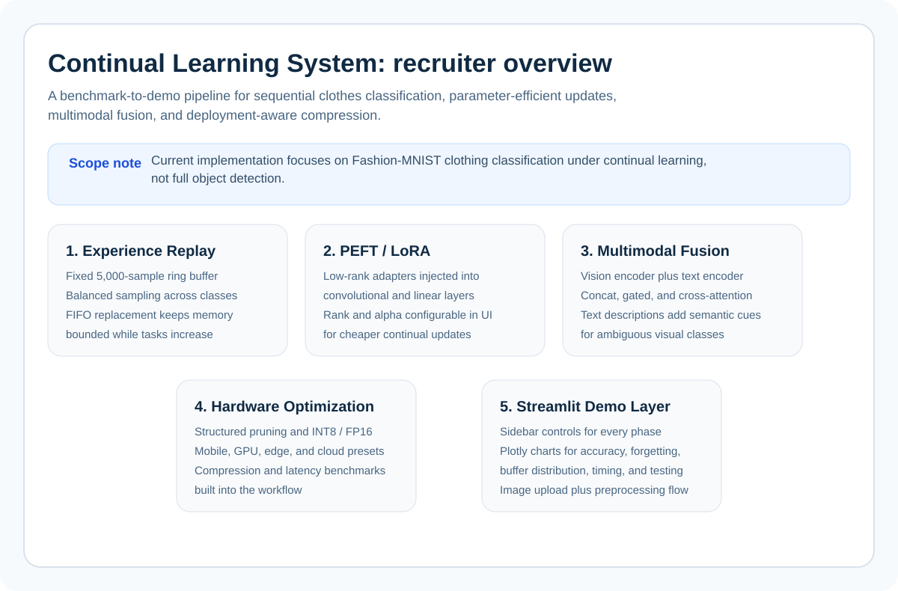
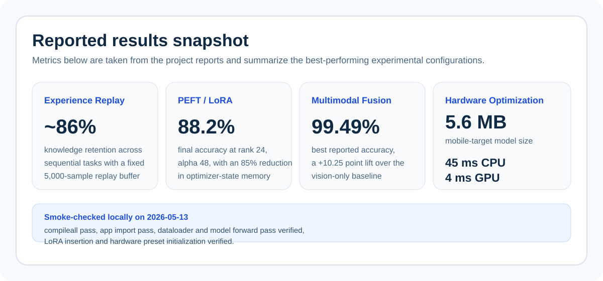

# Continual Learning System for Fashion-MNIST

A PyTorch and Streamlit project for experimenting with continual image classification on Fashion-MNIST. The system trains on sequential class groups, evaluates forgetting across previously learned tasks, and includes optional replay, LoRA-style adapters, multimodal fusion, and model compression utilities.

> Scope: this repository implements a Fashion-MNIST continual classification benchmark. It is not an object detection pipeline, despite the historical repository name.

[](https://www.python.org/downloads/)
[](https://pytorch.org/)
[](https://streamlit.io/)




## Overview

The project studies catastrophic forgetting in a controlled setting. Fashion-MNIST is split into five sequential tasks, each containing two classes. A model is trained task by task, then evaluated on both the current task and previously seen tasks.

The codebase is organized around four experiment tracks:

- standard continual finetuning with optional experience replay
- parameter-efficient continual learning with LoRA-style adapters
- vision-text multimodal classification using class descriptions
- hardware-aware compression with pruning and quantization utilities

The Streamlit app provides a UI for running experiments, visualizing task accuracy, inspecting replay-buffer behavior, saving checkpoints, and testing trained models interactively.

## Features

| Component | Description |
|---|---|
| Task split | 5 sequential Fashion-MNIST tasks, 2 classes per task |
| Replay buffer | Fixed total memory budget with class-balanced sampling |
| LoRA adapters | Low-rank adaptation for convolutional and linear layers |
| Multimodal model | CNN image encoder, lightweight text encoder, and fusion layers |
| Fusion strategies | Concatenation, gated fusion, and cross-attention |
| Metrics | Task accuracy, per-class accuracy, forgetting estimate, buffer statistics |
| Compression | Pruning, FP16 conversion, INT8/QAT utilities, target hardware presets |
| Demo UI | Training controls, Plotly charts, image upload, random sample testing, batch evaluation |

## Architecture

```text
app.py                         Streamlit experiment dashboard
data/
  fashion_mnist_true_continual.py
  fashion_text.py              Task splits and class text descriptions
models/
  simple_cnn_multiclass.py     CNN image classifier
  peft_lora.py                 LoRA adapter implementation
  text_encoder.py              Character-level text encoder
  multimodal_fusion.py         Fusion modules and multimodal classifier
trainers/
  trainer.py                   Single-task training loop
  continual_trainer.py         Replay-based continual trainer
  peft_trainer.py              LoRA continual trainer
  multimodal_trainer.py        Vision-text continual trainer
  hardware_trainer.py          Compression wrapper
replay/
  buffer.py                    Fixed-budget replay buffer
optimizers/
  pruning.py
  quantization.py
  hardware_optimizer.py
  benchmark.py                 Compression and profiling utilities
eval/
  metrics.py
  logger.py
assets/
  pipeline-overview.svg
  results-snapshot.svg
```

## Quick Start

```bash
python -m venv .venv
.\.venv\Scripts\activate
python -m pip install -r requirements.txt
python -m streamlit run app.py
```

On Windows, the helper script can be used instead:

```bat
run_app.bat
```

The app opens at `http://localhost:8501`.

Fashion-MNIST is downloaded automatically through `torchvision` on first run. Generated dataset files and checkpoints are ignored by Git:

- `data/FashionMNIST/`
- `checkpoints/`
- `__pycache__/`

## Running Experiments

The sidebar controls the experiment strategy and training configuration.

Available strategies:

- `Experience Replay`: trains a CNN on sequential tasks with optional replay
- `PEFT/LoRA`: injects low-rank adapters and trains only the trainable adapter path by default
- `Multi-Modal (Vision + Text)`: combines image features with class-level text descriptions
- `Hardware Optimization`: applies compression after continual training

The training tab tracks:

- overall progress
- task accuracy over time
- average forgetting
- replay-buffer utilization
- per-class validation results
- checkpoint size

The testing tab supports:

- uploaded image classification
- random samples from Fashion-MNIST
- task-level and class-level batch evaluation

## Validation

Smoke-check syntax without creating bytecode:

```bash
python -B -c "import pathlib; [compile(p.read_text(encoding='utf-8'), str(p), 'exec') for p in pathlib.Path('.').rglob('*.py') if '.git' not in p.parts]"
```

Smoke-check core model paths:

```bash
python -B -c "import torch; from models.simple_cnn_multiclass import SimpleCNNMulticlass; from models.peft_lora import apply_lora_to_model; from models.text_encoder import SimpleTextEncoder, get_tokenizer, encode_texts; from models.multimodal_fusion import MultiModalClassifier; model=SimpleCNNMulticlass(10); assert model(torch.randn(2,1,28,28)).shape==(2,10); _, trainable, total=apply_lora_to_model(SimpleCNNMulticlass(10), rank=4, alpha=8); assert trainable < total; text_encoder=SimpleTextEncoder(vocab_size=get_tokenizer().vocab_size); input_ids, mask=encode_texts(['a casual shirt','ankle boot']); multi=MultiModalClassifier(SimpleCNNMulticlass(10), text_encoder); assert multi(torch.randn(2,1,28,28), input_ids, mask).shape==(2,10)"
```

## Notes on Reported Results

The charts and project report results were produced from local experiment runs. They should be treated as experiment observations rather than fixed benchmark guarantees. Hardware, random seeds, training length, and the selected strategy can change the final metrics.

For formal comparison, run the experiments from a clean environment and record:

- random seed
- strategy and hyperparameters
- number of tasks
- epochs per task
- replay configuration
- final checkpoint
- task accuracy matrix

## Limitations

- Fashion-MNIST is a small benchmark and does not represent production-scale visual data.
- The repository currently has smoke checks, not a complete automated test suite.
- Multimodal training uses class descriptions as controlled semantic hints.
- Compression utilities are designed for experimentation and need more evaluation before deployment.
- Full reproducibility would benefit from a dedicated CLI benchmark runner and structured experiment logs.

## Roadmap

- Add pytest coverage for task splits, replay sampling, LoRA wrapping, and multimodal forward passes.
- Add a reproducible benchmark CLI that exports config, metrics, and checkpoints.
- Store experiment logs as CSV/JSON for easier report generation.
- Evaluate on a harder continual-learning benchmark.
- Add a model card for any published checkpoint.

## License

No license is included yet. Add one before distributing or reusing the project as a package.
