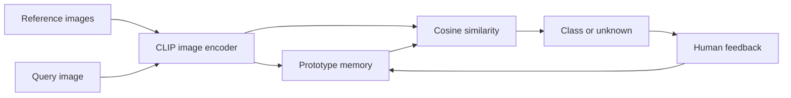

# Adaptive Vision Service

An image classification service that can learn a new visual class from a small set of reference images. It uses a frozen CLIP image encoder and stores one incremental prototype per class, so adding a class does not require retraining or redeploying the backbone.

The repository includes a FastAPI service, a Streamlit operations dashboard, persistent prototype memory, feedback updates, rolling unknown-rate metrics, a folder-based evaluation command, automated tests, and a two-service Docker deployment.

## How It Works

1. Reference images are converted to normalized CLIP embeddings.
2. The service maintains the sum and count of embeddings for each class.
3. A query is compared with normalized class prototypes using cosine similarity.
4. Predictions below the configured threshold are returned as unknown.
5. Corrected samples can be submitted as feedback and update the prototype immediately.

This design targets cases where labels evolve faster than a conventional training and deployment cycle, such as product catalogs, defect categories, internal assets, and field inspection workflows.



## Run With Docker

```bash
docker compose up --build
```

- Dashboard: `http://localhost:8501`
- API documentation: `http://localhost:8000/docs`
- Health endpoint: `http://localhost:8000/health`

The first inference request downloads the configured CLIP checkpoint. Docker Compose keeps the model cache and prototype state in named volumes, so subsequent starts reuse them.

## API Workflow

Add reference images to a class:

```bash
curl -X POST "http://localhost:8000/v1/classes/damaged-connector/examples" \
  -F "files=@samples/damaged-connector/01.jpg" \
  -F "files=@samples/damaged-connector/02.jpg"
```

Classify an image:

```bash
curl -X POST "http://localhost:8000/v1/predict?top_k=3" \
  -F "file=@samples/query.jpg"
```

Submit a corrected label:

```bash
curl -X POST "http://localhost:8000/v1/feedback/damaged-connector" \
  -F "file=@samples/query.jpg"
```

| Method | Endpoint | Purpose |
|---|---|---|
| `GET` | `/health` | Process and model state |
| `GET` | `/v1/classes` | Class memory inventory |
| `POST` | `/v1/classes/{label}/examples` | Add one or more reference images |
| `DELETE` | `/v1/classes/{label}` | Remove a class prototype |
| `POST` | `/v1/predict` | Return ranked matches or unknown |
| `POST` | `/v1/feedback/{label}` | Apply a corrected sample |
| `GET` | `/v1/metrics` | Rolling similarity and unknown-rate metrics |

## Local Development

Python 3.10 or newer is required.

```powershell
python -m venv .venv
.\.venv\Scripts\Activate.ps1
python -m pip install -r requirements-dev.txt
python -m uvicorn api:app --reload --port 8000
```

In a second terminal:

```powershell
$env:ADAPTIVE_VISION_API_URL = "http://localhost:8000"
python -m streamlit run dashboard.py
```

Runtime settings can be copied from `.env.example` or supplied by the deployment environment.

| Variable | Default | Description |
|---|---|---|
| `VISION_MODEL_NAME` | `openai/clip-vit-base-patch32` | Hugging Face checkpoint |
| `VISION_DEVICE` | `auto` | `auto`, `cpu`, or `cuda` |
| `VISION_STATE_PATH` | `artifacts/prototypes.json` | Persistent prototype snapshot |
| `VISION_CONFIDENCE_THRESHOLD` | `0.55` | Minimum top similarity for a known result |
| `VISION_DRIFT_WINDOW_SIZE` | `500` | Number of predictions retained in memory |
| `VISION_MAX_UPLOAD_MB` | `10` | Per-file upload limit |

## Evaluation

The evaluator expects one directory per class. It selects a deterministic support set, teaches every class, evaluates the remaining images, and writes configuration plus aggregate and per-class results to JSON.

```text
dataset/
  class-a/
    001.jpg
    002.jpg
  class-b/
    001.jpg
    002.jpg
```

```bash
python -m eval.benchmark dataset --support-per-class 5 --output benchmark-results.json
```

Do not treat the default `0.55` threshold as universal. Calibrate it on validation data from the target domain and inspect both accuracy and unknown rate.

## Tests

```bash
python -m pytest
python -m ruff check .
```

The tests use a deterministic color embedder instead of downloading CLIP. They cover incremental prototype updates, persistence, dimension validation, known and unknown predictions, feedback, and the multipart API workflow.

## Project Layout

```text
api.py                         FastAPI application and HTTP validation
dashboard.py                   Streamlit client for API operations
models/
  adaptive_service.py          Application workflow and decision threshold
  embeddings.py                Lazy CLIP adapter
  prototype_memory.py          Incremental prototypes and JSON persistence
  drift.py                     Rolling operational metrics
  config.py                    Environment configuration
eval/
  benchmark.py                 Folder-based few-shot evaluation
  test_*.py                    Unit and API tests
Dockerfile                     Shared API/dashboard image
docker-compose.yml             Two-service local deployment
```

## Boundaries

- Prototype JSON is appropriate for a single API replica. Multiple writers require a transactional store or vector database.
- Drift metrics are process-local and reset on restart. Export them to an observability backend for production use.
- Prototype classification works best when class appearance is coherent. Fine-grained domains may require a trained metric head or supervised fine-tuning.
- The service does not retain uploaded source images. Only aggregate embedding sums and counts are persisted.

## License

No license is currently included. Add one before redistributing the project or its code.
