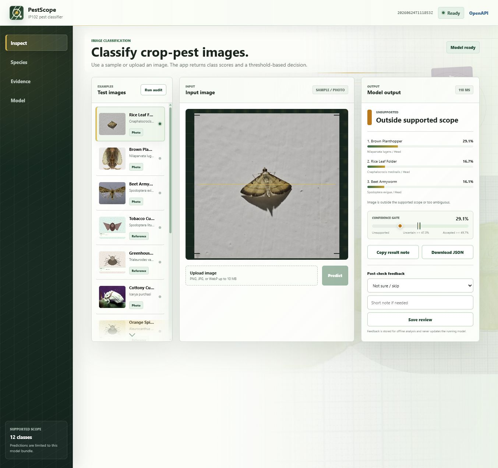
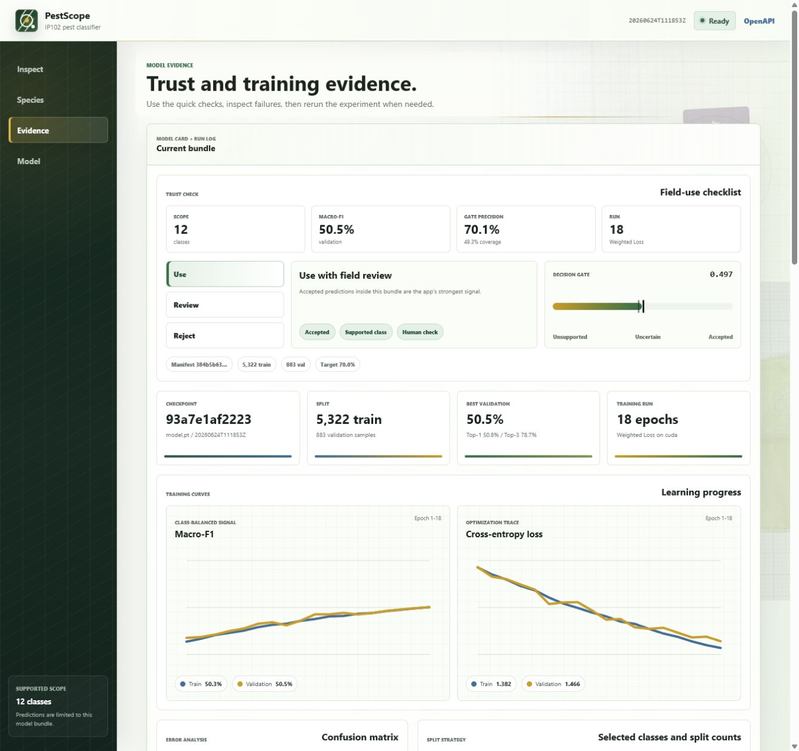
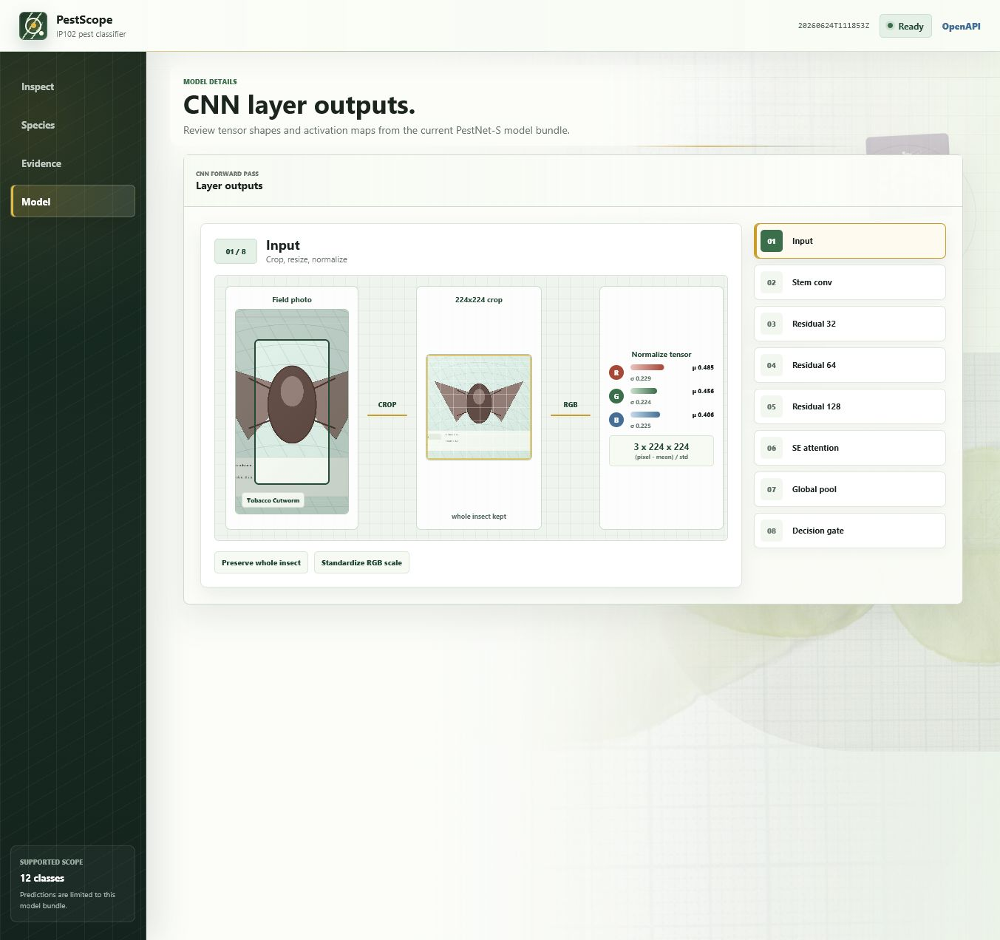

# PestScope IP102

PestScope is a crop-pest image triage app built around a custom CNN trained from
scratch on a reviewed IP102 subset. The goal is not to force a label for every
image. The app shows top-k predictions, confidence gates, model evidence, failure
cases, and enough reproducibility detail to rerun the experiment.

The current public repo keeps source code, configs, tests, Docker setup, and UI
screenshots. IP102 images and large model artifacts stay outside Git.

## Screenshots

These screenshots were captured from the Docker app running locally, not mocked
or drawn separately.







## What This Project Covers

- A reviewed 12-class IP102 pest scope with common names, scientific names, and
  class strata.
- A compact residual CNN, `PestNet-S`, implemented in PyTorch instead of using a
  hosted pretrained classifier.
- A FastAPI inference service with upload prediction, sample prediction,
  readiness checks, model metadata, offline review capture, and OpenAPI docs.
- An interactive web UI for inspection, supported species, training evidence,
  failure analysis, and CNN layer outputs.
- Docker Compose deployment that can run with a mounted trained bundle or a
  clearly marked demo fallback.
- Reproducible training and evaluation commands with fixed seed, config files,
  model bundles, calibration thresholds, and artifact paths.

## Quick Start With Docker

Docker is the easiest way to run the full app.

```powershell
docker compose up --build
```

Open:

- App: `http://127.0.0.1:8000`
- OpenAPI: `http://127.0.0.1:8000/docs`
- Readiness: `http://127.0.0.1:8000/api/v1/health/ready`

Stop it:

```powershell
docker compose down
```

If port `8000` is busy, set a different host port in `.env`:

```env
PESTSCOPE_PORT=8010
```

Then open `http://127.0.0.1:8010`.

### Docker Artifact Mount

`docker-compose.yml` bind-mounts local artifacts:

```yaml
./artifacts:/app/artifacts
```

That means:

- If `artifacts/models/pestnet_s_latest` exists locally, Docker serves that real
  trained bundle.
- If no bundle exists, the API creates a demo bundle so the UI and endpoints can
  still be tested. Demo fallback is useful for first-time launch, but it should
  not be reported as model performance.
- Human review feedback is stored at `artifacts/reviews.sqlite3`.

## Run Locally Without Docker

```powershell
python -m pip install -r requirements-dev.txt
python -m uvicorn api:app --host 127.0.0.1 --port 8000
```

Open `http://127.0.0.1:8000`.

## Current Model Evidence

The latest local bundle used while building the app is:

- Model: `pestnet_s`
- Run: `20260624T111853Z`
- Parameters: `2,812,908`
- Validation top-1: `50.8%`
- Validation top-3: `78.7%`
- Macro-F1: `50.5%`
- Balanced accuracy: `55.1%`
- Accepted precision after confidence gate: `70.1%`
- Accepted coverage: `49.3%`

These are validation metrics for the reviewed 12-class scope, not a final IP102
leaderboard claim.

### Section 6 Comparison

The project keeps a small comparison suite so model changes are checked against
simpler alternatives on the same class scope.

| Model | Params | Top-1 | Top-3 | Macro-F1 | Accepted precision | Accepted coverage |
|---|---:|---:|---:|---:|---:|---:|
| PestNet-S | 2,812,908 | 50.8% | 78.7% | 50.5% | 70.1% | 49.3% |
| PestNet-S without attention | 2,779,564 | 45.4% | 68.2% | 44.0% | 70.0% | 38.5% |
| SimpleCNN | 95,020 | 35.6% | 60.9% | 34.4% | 70.0% | 12.5% |

The important part is the behavior, not just the number: the residual CNN gives
better class-balanced signal and more usable accepted coverage, while the
confidence gate still lets the app reject weak images.

## Dataset Scope

PestScope uses IP102, a pest image dataset for agricultural recognition. This
repo currently works on a reviewed 12-class subset instead of all 102 classes.
That smaller scope is intentional for this stage:

- It keeps labels auditable.
- It makes failure analysis readable.
- It lets the app show honest uncertainty instead of pretending every class is
  production-ready.

The full dataset and raw images are not committed. Put them under:

```text
data/raw/ip102/ip102_v1.1
```

Generated manifests and local model outputs live under `artifacts/`.

## Train

Smoke-test training on CPU:

```powershell
python scripts\train_pestnet.py `
  --max-epochs 1 `
  --limit-train-per-class 2 `
  --limit-val-per-class 1 `
  --device cpu `
  --bundle-dir artifacts\models\pestnet_s_smoke
```

Train the baseline experiment:

```powershell
python scripts\train_pestnet.py --config configs\train\pestnet_s.yaml --device cuda --progress
```

Train the stronger next-run candidate:

```powershell
python scripts\train_pestnet.py --config configs\train\pestnet_s_optimized.yaml --device cuda --progress
```

The default promoted bundle path is:

```text
artifacts/models/pestnet_s_latest
```

## Evaluate And Calibrate

Evaluate a bundle and write thresholds back to metadata:

```powershell
python scripts\evaluate_pestnet_bundle.py `
  --bundle-dir artifacts\models\pestnet_s_latest `
  --split val `
  --device cpu `
  --limit-id-per-class 6 `
  --limit-ood-per-class 2 `
  --write-thresholds
```

Compare model variants:

```powershell
python scripts\compare_model_runs.py --suite configs\experiments\section6.yaml
```

Run the small external-image sanity check:

```powershell
python scripts\build_external_benchmark.py
python scripts\evaluate_external_benchmark.py --bundle-dir artifacts\models\pestnet_s_latest --device cpu
```

The external benchmark is deliberately small. It is used to catch obvious domain
shift problems, not to claim broad field performance.

## API Surface

| Method | Endpoint | Purpose |
|---|---|---|
| `GET` | `/api/v1/health/live` | Process liveness |
| `GET` | `/api/v1/health/ready` | Model readiness and demo status |
| `GET` | `/api/v1/model` | Model card, classes, preprocessing, thresholds |
| `GET` | `/api/v1/examples` | Bundled sample images and attribution |
| `POST` | `/api/v1/examples/{id}/predict` | Predict one bundled sample |
| `POST` | `/api/v1/predictions` | Predict one uploaded image |
| `POST` | `/api/v1/reviews` | Store offline human feedback |
| `GET` | `/api/v1/experiments/current` | Curves, confusion, split, failure analysis |

## Project Layout

```text
api.py                         FastAPI app and static web routes
index.html / app.js / styles.css
configs/
  data/                        IP102 class review and subset configs
  train/                       Training configs
  experiments/                 Model comparison suites
scripts/                       Dataset, training, evaluation, benchmark tools
src/pestscope/
  data/                        Manifest and audit pipeline
  modeling/                    PestNet-S CNN
  training/                    Dataset, transforms, runner, metrics
  evaluation/                  Calibration and external benchmark
  inference/                   Runtime service, examples, reviews
tests/                         API, data, modeling, training, evaluation tests
docs/screenshots/              Real screenshots captured from the running app
```

## Verification

```powershell
python -m pytest -q
python -m ruff check src\pestscope api.py scripts tests --no-cache
python -m ruff format --check src\pestscope api.py scripts tests
docker compose config --quiet
docker compose build
docker compose up -d
Invoke-RestMethod http://127.0.0.1:8000/api/v1/health/ready
```

Verified locally during the Docker/README pass:

- `docker compose config --quiet`
- `docker compose build`
- `docker compose up -d`
- readiness returned `{"status":"ready","model_version":"20260624T111853Z","demo_model":false}`
- `python -m pytest tests/api/test_pestscope_api.py -q`

## Known Limits

- The current public scope is 12 classes, not all 102 IP102 classes.
- Some class examples fall back to local reference images when external assets
  are unavailable.
- Current metrics are still modest. The app surfaces this through failure
  analysis instead of hiding it.
- Raw IP102 data and large model weights are intentionally excluded from Git.

Detailed design notes and section gates live in `DESIGN_REPORT_IP102.md`.
